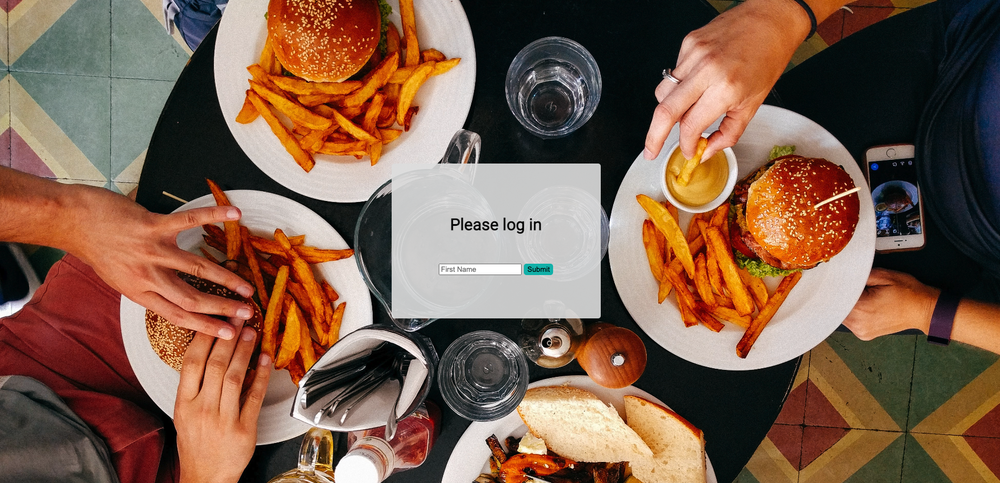
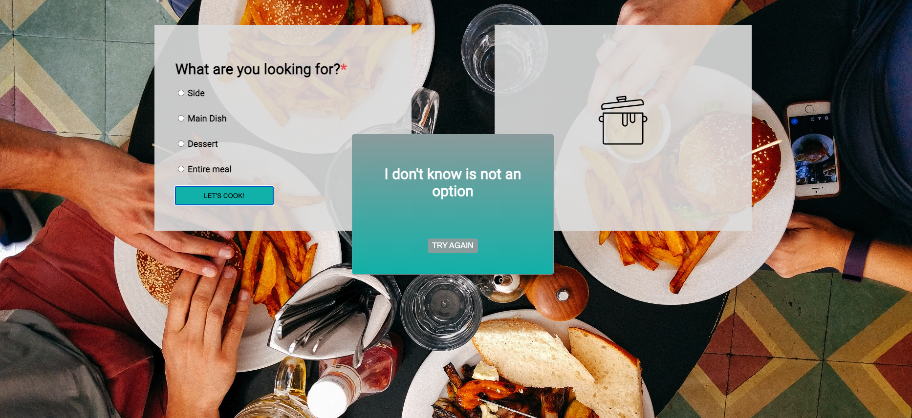
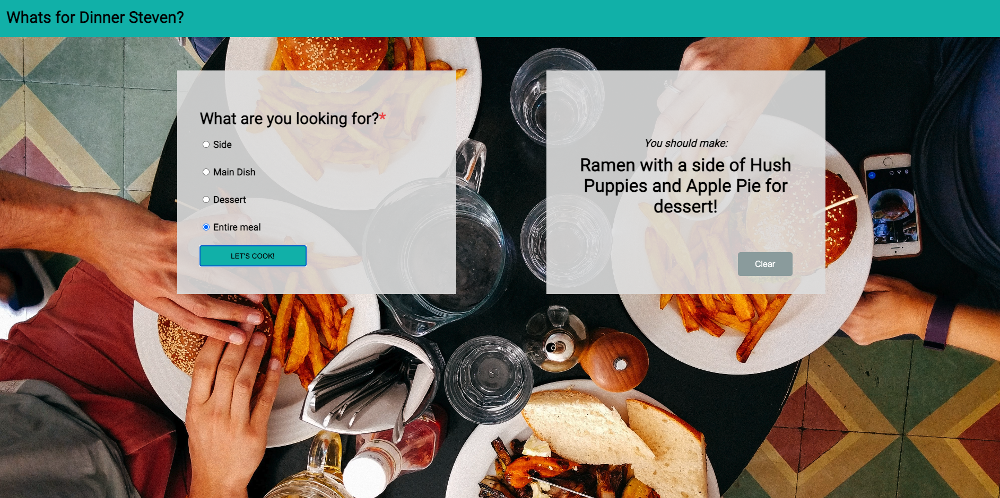

# What's for Dinner?

What's for dinner is a web based app that will generate a random dish suggestion for the user to cook.  Users are able to pick between a side, entree, dessert, or entire meal option.

[What's for Dinner?](https://itsnameissteven.github.io/whats-for-dinner/)

## Contributors

Steven Mancine [Github](https://github.com/itsnameissteven)

## Technologies

What's for dinner was built with html, external css and javaScript.

### Login page

When the page first loads users must login with their first name to proceed.  Once the user logs in they are welcomed with a hello message which utilizes a timeout function.  In the home page view the user's name will populate in the navigation bar.

### Error-handling

The site utilizes error handling in two areas.  The first is the login page, if no input is received they cannot proceed to the next page. The second is when trying to populate a random dish without selecting a type of dish.  If the user failed to select a dish a pop up will display asking them to try again.  

### Populating Random Dishes

Once the user selects the type of dish they prefer to make javaScript will utilize pick one using a random algorithm.  Each dish has its own array, which is accessed based on user input. If a user request an entire meal one type of each dish will be suggested.

### Future Consideration

In the future intermediate CSS should be added to this web page.  If the page is viewed on a cell phone or tablet it is not properly formatted.  User accessibility is only available on computers at the moment.  
